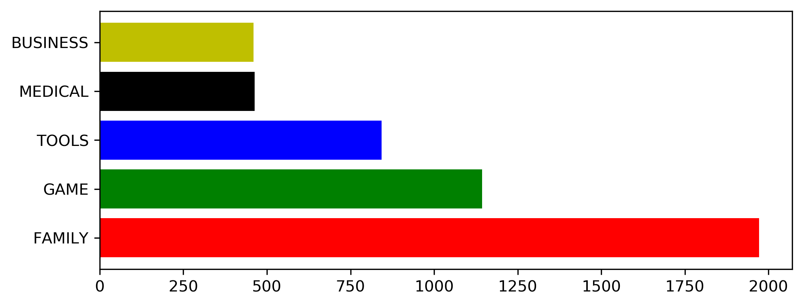
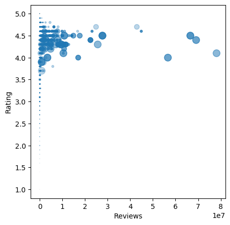
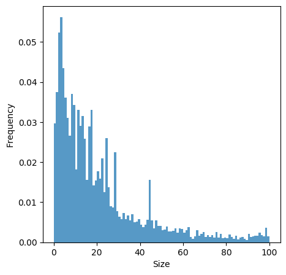
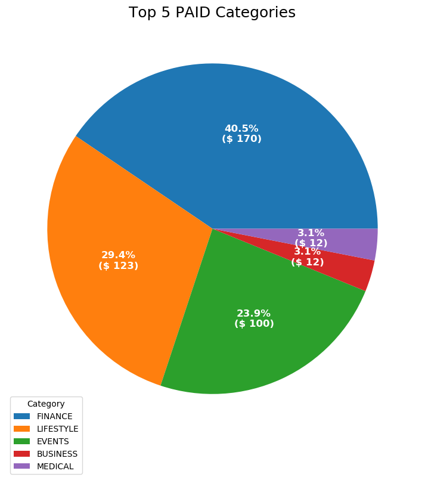

# Google Play Store Analysis using Flask Dashboard UI (Python)
## Introduction
Project kali ini yaitu menganalisa suatu file `csv`dengan menggunakan pandas dan python untuk disajikan kedalam bentuk web sederhana (dashboard) mmenggunakan framework `Flask`. 

## Dependencies 
- Pandas
- Matplotlib
- Numpy
- Flask

semua modul tersebut dapat diinstal kedalam environment pada file txt dengan cara:

`pip install -r requirements.txt`

## Rubrics
### Data Wrangling and EDA 
melakukan filtering, subseting, indexing, dan penyesuaian tipe data menjadi lebih sesuai dengan menggunakan fungsi pada `pandas` dan `numpy`. adapun, salah satu cara tersebut adalah 

- drop duplicates: `df.____(subset ='____', keep='____', inplace=True)`
- cleaning data: `df.apply(lambda x: x.replace('____','____')`
- change type data: `df.astype('____')`

Untuk membuat tabel `top_category`aplikasi berdasarkan reviews, dapat menggunakan aggregasi (crosstab/table) pada pandas dengan cara:

`pd.crosstab(
    index=df.'____',
    columns=df.'____',
    values=df.'____',
    aggfunc='____'
)`

### Data Visualization 
- membuat summary statistik yang berisikan `most_categories` yaitu kategori aplikisi terbanyak dan `total_in_market` yaitu jumlah aplikasi pada `most_categories` yang ada di market
- membuat bar chart yang berisikan `top_category` pada aplikasi di market dengan jumlah terbanyak

- membuat scatter plot unyuk sebaran data pada nilai Reviews vs Rating

- membuat histogram untuk frekuensi aplikasi yang sering diinstall berdasarkan size

- membuat pie chart

### Build Flask App 
membuat dashboard pada web dengan menggunakan Flask dengan cara 

`render_templates(____)`

pada file `templates/index.html` perlu memmangil source plot.png pada directory gambar

